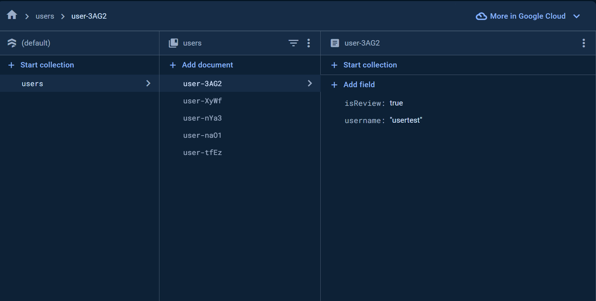
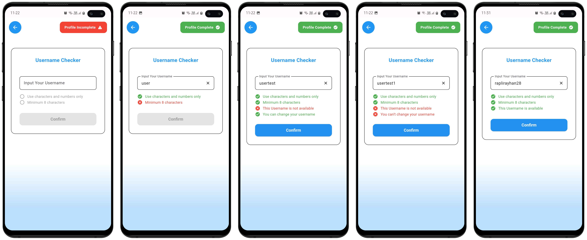

# Username Checker

## Overview
The Username Checker App is a Flutter application that allows users to check the availability and validity of a username. It integrates with Firebase Firestore to verify if a username is already taken and whether it can be changed based on specific conditions.

## Firestore Setup

To set up Firestore for this application, you need to create a Firestore collection named `users` with the following documents for testing:

1. Document ID: `user-{randomId}`
    - `username`: `usertest`
    - `isReview`: `true`

2. Document ID: `user-{randomId}`
    - `username`: `usertest1`
    - `isReview`: `false`

Ensure that your Firestore structure looks like this:

## Implementation Details

### `utils/firestore_helper.dart`

- Interacts with Firestore to check username availability and changeability.
- `checkUsernameAvailability`: Checks if a username is available by querying the 'users' collection.
- `canChangeUsername`: Checks if a username can be changed by querying the 'users' collection and checking the 'isReview' field.

### `controllers/username_controller.dart`

- Manages username-related functionality using GetX, including validation and interaction with Firestore.
- `validateUsername`: Validates the input username for alphanumeric characters and minimum length.
- `clearUsername`: Clears the username input.
- `checkUsername`: Checks the availability and changeability of the username using FirestoreHelper.

## Output
